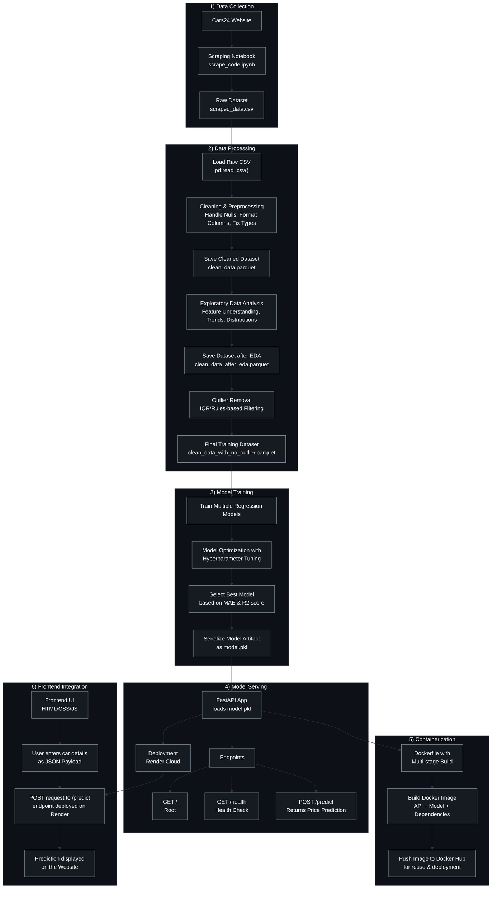

<h2 align='center'>AutoIQ : Used Car Pricing System</h2>

<p align="center">
  <!-- Live Demo -->
  <a href="https://themrityunjaypathak.github.io/AutoIQ/" target="_blank">
    
  </a>
  
  <!-- Python -->
  <a href="https://www.python.org/" target="_blank">
    
  </a>

  <!-- Pandas -->
  <a href="https://pandas.pydata.org/" target="_blank">
    
  </a>

  <!-- Scikit-learn -->
  <a href="https://scikit-learn.org/stable/" target="_blank">
    
  </a>

  <!-- FastAPI -->
  <a href="https://autoiq.onrender.com/docs" target="_blank">
    
  </a>

  <!-- Docker -->
  <a href="https://hub.docker.com/r/themrityunjaypathak/autoiq" target="_blank">
    
  </a>

  <!-- Git -->
  <a href="https://git-scm.com/" target="_blank">
    
  </a>
</p>

<a href="https://themrityunjaypathak.github.io/AutoIQ/"></a>

## Table of Contents
- [Problem Statement](#problem-statement)
- [Dataset](#dataset)
- [Workflow](#workflow)
- [Setup](#setup)
- [Testing](#testing)
- [Dockerization](#dockerization)
- [Deployment](#deployment)
- [Application](#application)
- [Model Training & Evaluation](#model-training--evaluation)
- [Challenges & Solutions](#challenges--solutions)
- [Impact](#impact)
- [Folder Structure](#folder-structure)
- [License](#license)

<hr>

## Problem Statement
- In the used car market, buyers and sellers often struggle to determine a fair price for their vehicle.
- This project aims to provide accurate and transparent pricing for used cars by analyzing real-world data.

<hr>

## Dataset
- To train the model, I collected real-world used car listings data directly from the [Cars24](https://www.cars24.com/) website.
- Since Cars24 uses dynamically loaded content, a static scraper would not capture all the data.
- Instead, I implemented an automated Selenium + BeautifulSoup Python Script.

### Web Scraping Script (`scrape_car_listing`)

**Input :** URL of a Cars24 listing page to scrape.

#### 1. Launch Chrome Automatically
- Script uses `ChromeDriverManager` to install and manage the drivers without manual setup.
  
#### 2. Open Cars24 Website
- Loads the given URL in a real browser session.

#### 3. Simulate Scrolling
- Scrolls down the page in increments, with short random pauses (2-4 seconds) between scrolls.
- This ensures all dynamically loaded listings are fetched.
  
#### 4. Check for End of Page
- Stops scrolling when the bottom of the page is reached or no new content loads.

#### 5. Capture Rendered HTML
- Once fully loaded, it retrieves the complete DOM (including dynamically injected elements).
  
#### 6. Parse HTML with BeautifulSoup
- Returns a BeautifulSoup object containing the entire page's HTML for later parsing and data extraction.

> [!NOTE]
> 
> At this stage, no data is extracted, the output is just the complete HTML source.
> 
> It which will be parsed to a separate script to extract features like price, model, year, transmission, etc.

<hr>

### Data Extraction Script (`get_car_details`)

**Input :** BeautifulSoup object (`soup`) containing the fully-rendered HTML of a Cars24 listing page.

#### 1. Find Raw Model Name Texts
- Looks for `<span>` elements with class `sc-braxZu kjFjan`.
- Extracts the text using `.text` into a list called `model_name`.
- The code only keeps those model that start with `2` and stores them in `clean_model_name`.

<details>
<summary>Click to view the HTML Element Snapshot</summary>
&nbsp;

</details>

> [!IMPORTANT]
>
> Inspect the HTML Element : `<span id class="sc-braxZu kjFjan">2016 Maruti Wagon R 1.0</span>`
>
> Tag : `<span>` → id (empty) → class : `sc-braxZu kjFjan` (two classes, separated by space)
> 
> However when you hover over it in the browser, it shows : `span.sc-braxZu.kjFjan`
>
> CSS uses a dot `.` to indicate classes. The dot is not a part of the class name itself.
>
> It just means "this is a class", it is not the part of the class name.
>
> This might look confusing for someone with little HTML/CSS knowledge, so it's better to clarify it.

#### 2. Collect Specification Text Blocks
- Looks for `<p>` elements with class `sc-braxZu kvfdZL` (each holds one specification value).
- These are appended to `specs` list.
   
```python
['69.95k km',
 'Petrol',
 'Manual',
 '1st owner',
 'DL-1C',
 '70.72k km',
 'Diesel',
 'Manual',
 '2nd owner',
 'UP-14',
 '15.96k km',
 'CNG',
 'Manual',
 '1st owner',
 'UP-16',...]
```

<details>
<summary>Click to view the HTML Element Snapshot</summary>
&nbsp;

</details>

#### 3. Group Specifications
- The flat `specs` list is split into consecutive groups of 5 (`clean_specs.appendspecs[i:i+5])`).
- Each group corresponds to one listing's set of specification value.
   
```python
[['69.95k km', 'Petrol', 'Manual', '1st owner', 'DL-1C'],
 ['70.72k km', 'Diesel', 'Manual', '2nd owner', 'UP-14'],
 ['15.96k km', 'CNG', 'Manual', '1st owner', 'UP-16'],...]
```

#### 4. Map Groups into Fields
- From each 5-item group, the script extracts :
    - `clean_specs[0]` → `km_driven`
    - `clean_specs[1]` → `fuel_type`
    - `clean_specs[2]` → `transmission`
    - `clean_specs[3]` → `owner`
- `clean_specs[4]` → `number_plate` exists but is of no use.

#### 5. Extract Price Values
- `soup.find_all('p', 'sc-braxZu cyPhJl')` collects price elements into `price` list.
- The script then slices `price = price[2:]`, removing the first two entries (non-listing elements on the page).
- So the remaining prices align with the listings.

```python
['₹3.09 lakh',
 '₹5.71 lakh',
 '₹7.37 lakh',...]
```

<details>
<summary>Click to view the HTML Element Snapshot</summary>
&nbsp;

</details>

#### 6. Extract Listing Links
- `soup.find_all('a', 'styles_carCardWrapper__sXLIp')` collects anchor tag for each card and extracts `href`.

```python
['https://www.cars24.com/buy-used-honda-amaze-2018-cars-noida-11068642783/',
 'https://www.cars24.com/buy-used-ford-ecosport-2020-cars-noida-11234948707/',
 'https://www.cars24.com/buy-used-tata-altroz-2024-cars-noida-10563348767/',...]
```

<details>
<summary>Click to view the HTML Element Snapshot</summary>
&nbsp;

</details>

#### 7. Combine into a DataFrame
- All lists are assembled into a `pandas.DataFrame`.
- The column names are `model_name`, `km_driven`, `fuel_type`, `transmission`, `owner`, `price`, `link`.

#### 8. Return the DataFrame
- Finally, function returns the above DataFrame for further cleaning, analysis and modelling.

<hr>

### Engine Capacity Script (`get_engine_capacity`)

**Input :** List of URLs for individual car listings (`link` from the previous DataFrame).

#### 1. Iterate through each Car Listing URL
- Loops over the list of individual car listing page URL.

#### 2. Send an HTTP Request
- Uses the `requests` library to retrieve each page's HTML content.
- Adds a User-Agent header to simulate a real browser and reduce blocking risk.
- Applies a random timeout (4-8 seconds) between requests to avoid overloading the server.

#### 3. Parse the HTML Content
- Converts the response into a BeautifulSoup object using the `lxml` parser for fast, reliable parsing.

#### 4. Locate Engine Capacity Label
- Searches for all `<p>` tags with the class `sc-braxZu jjIUAi`.
- Checks if the text exactly matches "Engine capacity".

<details>
<summary>Click to view the HTML Element Snapshot</summary>
&nbsp;

</details>

#### 5. Extract the Value
- If the label is found, grab the value from the next sibling element (`1197 cc`).
- Marks the entry as successfully found.
- If no engine capacity value is found, store `None` to maintain positional consistency.

#### 6. Return the List
- Outputs a list of engine capacities in the same order as the input URLs.

<hr>

### Combine Data from Multiple Cities

<details>
<summary>Click Here to view Example Function</summary>
<br>

```python
# Parsing HTML Content of Hyderabad City from Cars24 Website
soup = scrape_car_listing('https://www.cars24.com/buy-used-cars-hyderabad/')

# Extracting Car Details of Hyderabad City
hyderabad = get_car_details(soup)
```

```python
# Parsing HTML Content of Bangalore City from Cars24 Website
soup = scrape_car_listing('https://www.cars24.com/buy-used-cars-bangalore/')

# Extracting Car Details of Bangalore City
bangalore = get_car_details(soup)
```

```python
# Parsing HTML Content of Mumbai City from Cars24 Website
soup = scrape_car_listing('https://www.cars24.com/buy-used-cars-mumbai/')

# Extracting Car Details of Mumbai City
mumbai = get_car_details(soup)
```

```python
# Parsing HTML Content of Delhi City from Cars24 Website
soup = scrape_car_listing('https://www.cars24.com/buy-used-cars-delhi-ncr/')

# Extracting Car Details of Delhi City
delhi = get_car_details(soup)
```

```python
# Concatenating Car Details of Different Cities into Single DataFrame
df = pd.concat([hyderabad, bangalore, mumbai, delhi], ignore_index=True)
df.head()
```

```python
# Extracting engine capacity of each car using its car listing link from Cars24 Website
engine_capacity = get_engine_capacity(df['link'])

# Adding "engine_capacity" column in the DataFrame
df['engine_capacity'] = engine_capacity

# Final DataFrame after Web Scrapping
df.head()
```
</details>

<hr>

### Dataset Description

The final dataset consists of 2,800+ unique car listings, with each record containing :

- `model_name` : Model name of the car (2014 Hyundai Grand i10, etc).         
- `fuel_type` : Type of fuel the car uses (Petrol, Diesel, CNG, Electric).        
- `transmission` : Type of transmission the car has (Automatic or Manual).           
- `owner` : Number of previous owners (1st owner, 2nd owner, 3rd owner, etc).
- `engine_capacity` : Size of the engine (in cc).                              
- `km_driven` : Total distance traveled by the car (in km).                   
- `price` : Selling price of the car (target variable).                      

> [!TIP]
>
> Scraping code in the repository depends on the current structure of the target website.
>
> Websites often update their HTML, element IDs or class names which can break the scraping logic.
>
> So before running the scraper, inspect the website to ensure the HTML structure matches the code.
>    
> Update any selectors or parsing logic if the website has changed.

<hr>

## Workflow



<hr>

## Setup

Follow these steps carefully to setup and run the project on your local machine :

### 1. Clone the Repository
First, you need to clone the project from GitHub to your local system.
```bash
git clone https://github.com/themrityunjaypathak/AutoIQ.git
```

### 2. Build the Docker Image
Docker allows you to package the application with all its dependencies.
```bash
docker build -t your_image_name .
```

> [!TIP]
>
> Make sure Docker is installed and running on your machine before executing this command.

### 3. Setup Environment Variables
This project uses a `.env` file to store configuration settings like model paths, allowed origins, etc.

#### `.env` file
- Stores environment variables in plain text.
```python
# .env
ENV=environment_name
MAE=mean_absolute_error
PIPE_PATH=pipeline_path
MODEL_FREQ_PATH=model_freq_path
ALLOWED_ORIGINS=list_of_URLs_that_are_allowed_to_access_the_API
```

> [!IMPORTANT]
> Never commit `.env` to GitHub / Docker.
> 
> Add `.env` to `.gitignore` and `.dockerignore` to keep it private.

#### `config.py` file
- Load and validate environment variables from `.env`.
- Uses Pydantic `BaseSettings` to read environment variables, validate types and provide easy access.

<details>
<summary>Click Here to view Example Python File</summary>
<br>

```python
# api/config.py
import os
from pathlib import Path
from typing import List
from pydantic_settings import BaseSettings

# Required Environment Variables
class Settings(BaseSettings):
    ENV: str = "dev"
    MAE: int
    PIPE_PATH: Path
    MODEL_FREQ_PATH: Path
    ALLOWED_ORIGINS: str  # Comma-separated

    # Convert ALLOWED_ORIGINS string into a list
    @property
    def cors_origins(self) -> List[str]:
        return [origin.strip() for origin in self.ALLOWED_ORIGINS.split(",")]

     # Load .env locally (development), but skips in Render (deployment)
    class Config:
        env_file = ".env" if not os.getenv("RENDER") else None

# Create an object of Settings class
settings = Settings()
```
</details>

#### `main.py` file
- Uses `settings` from `config.py` in FastAPI.
- Imports the `settings` object to provide API's metadata dynamically from `.env`.

<details>
<summary>Click Here to view Example Python File</summary>
<br>

```python
# api/main.py
import pickle
from fastapi import FastAPI
from fastapi.middleware.cors import CORSMiddleware
from api.config import settings

app = FastAPI(title="AutoIQ by Motor.co")

app.add_middleware(
    CORSMiddleware,
    allow_origins=settings.cors_origins,
    allow_credentials=True,
    allow_methods=["GET", "POST"],
    allow_headers=["*"],
)

with open(settings.PIPE_PATH, "rb") as f:
    pipe = pickle.load(f)

with open(settings.MODEL_FREQ_PATH, "rb") as f:
    model_freq = pickle.load(f)
```
</details>

### 4. Run the Docker Container
Start the application using Docker. This will run the FastAPI server and handle all the dependencies automatically.
```bash
docker run --env-file .env -p 8000:8000 your_image_name /
   uvicorn api.main:app --host 0.0.0.0 --port 8000 --reload
```

> [!NOTE]
> `api.main` → Refers to the main.py file inside the api folder.
> 
> `app` → The FastAPI instance defined in your code.
> 
> `--reload` → Automatically reloads when code changes (development only).

### 5. Access the FastAPI Server
Once the container is running, open your browser and navigate to :
```bash
http://localhost:8000/docs

or

http://127.0.0.1:8000/docs
```
This opens the Swagger UI for testing the API endpoints.

Access the live API [here](https://autoiq.onrender.com/docs) or Click on the Image below.

<a href="https://autoiq.onrender.com/docs"></a>

### 6. Stop the Docker Container
When you're done using the application, stop the running container.
```bash
docker stop your_image_name
```

<hr>

## Testing
Once the FastAPI server is running, you can test the API endpoints in Postman or any similar software.

### 1. Launch Postman and Create a New HTTP Request
- Launch the Postman application on your computer.
- Click on the "New" button, then select "HTTP" requests.


### 2. Using GET and POST Methods in Postman
#### → GET Method
- Retrieve information from the server without modifying any data.
#### → Steps
- Open Postman and create a new request.
- Set the HTTP method to "GET" from the dropdown menu.
- Enter the endpoint URL you want to query.
```
http://127.0.0.1:8000
```
- Click the "Send" button to submit the request.
#### → Expected Response
- **Status Code :** It indicates that the request was successful and the server responded with the requested data.
```
200 OK
```
- **Response Body (JSON) :** This confirms that the API is running and returns the result of your API call.
```json
{
    "message":"Pipeline is live"
}
```


#### → POST Method
- Send data to a server to create/update a resource.
#### → Steps
- Open Postman and create a new request.
- Set the HTTP method to "POST" from the dropdown menu.
- Enter the endpoint URL you want to query.
```
http://127.0.0.1:8000/predict
```
- Navigate to the "Headers" tab and add the following : Key → `Content-Type`, Value → `application/json`
- Go to the "Body" tab, Select "raw", then choose "JSON" from the format dropdown menu.
- Enter the request payload in JSON format.
```json
{
  "brand": "MG",
  "model": "HECTOR",
  "km_driven": 80000,
  "engine_capacity": 1498,
  "fuel_type": "Petrol",
  "transmission": "Manual",
  "year": 2022,
  "owner": "1st owner"
}
```
- Click the "Send" button to submit the request.
#### → Expected Response
- **Status Code :** It indicates that the server successfully processed the request and generated a prediction.
```
200 OK
```
- **Response Body (JSON) :** This confirms that the API is running and returns the result of your API call.
```json
{
  "output": "₹9,69,000 to ₹11,50,000"
}
```


<hr>

## Dockerization

Follow these steps carefully to containerize your project with Docker :

### 1. Install Docker
- Before starting, make sure Docker is installed on your system.
- Visit [Docker](https://www.docker.com/) → Click on Download Docker Desktop → Choose Windows / Mac / Linux


### 2. Verify the Installation
- Open Docker Desktop → Make sure Docker Engine is Running


### 3. Create the Dockerfile
- Create a `Dockerfile` and place it in the root folder of your Repository.

<details>
<summary>Click Here to view Example Dockerfile</summary>
<br>

```Dockerfile
# Start with the official Python 3.11 image.
# -slim means this is a smaller Debian-based image with fewer preinstalled packages, which makes it lighter.
FROM python:3.11-slim

# Install required system packages for Python libraries.
RUN apt-get update && apt-get install -y --no-install-recommends \
    gcc \
    g++ \
    python3-dev \
    libopenblas-dev \
    liblapack-dev \
    gfortran \
 && rm -rf /var/lib/apt/lists/*

# Set the working directory to /app inside the container.
# All future commands (COPY, RUN, CMD) will be executed from here.
WORKDIR /app

# Copies your local requirements.txt into the container's /app folder.
COPY requirements.txt .

# Install all the dependencies from requirements.txt.
# --no-cache-dir prevents pip from keeping installation caches, making the image smaller.
RUN pip install --no-cache-dir --upgrade pip && \
    pip install --no-cache-dir -r requirements.txt

# Copies all the remaining project files (Flask API, HTML, CSS, JS, etc.) into /app.
COPY . .

# Expose FastAPI port, so it can be accessed from outside the container.
EXPOSE 8000

# Default command to run the FastAPI app with Uvicorn in production mode.
# --host 0.0.0.0 allows external connections (necessary in Docker).
# --port 8000 specifies the port.
CMD ["uvicorn", "api.main:app", "--host", "0.0.0.0", "--port", "8000"]
```
</details>

### 4. Create the `.dockerignore` File
- This file tells Docker which files and folders to exclude from the image.
- This keeps the image small and prevents unnecessary files from being copied.
- A `.dockerignore` file is used to exclude all files and folders that are not required to run your application.

<details>
<summary>Click Here to view Example Dockerignore File</summary>
<br>

```bash
# Virtual Environment
.venv/

# Jupyter Notebooks
*.ipynb

# Jupyter Notebook Checkpoints
.ipynb_checkpoints/

# Python Cache
__pycache__/
*.pyc
*.pyo
*.pyd

# Environment File
.env
*.env

# Dataset (Parquet & CSV Files)
*.parquet
*.csv

# Python Package (utils)
utils/

# Local/Temporary Files
*.log
*.tmp
*.bak

# Version Control Files
.git/
.gitignore

# IDE/Editor Configs
.vscode/
.idea/
.DS_Store

# Python Package Build Artifacts
*.egg-info/
build/
dist/
```
</details>

### 5. Build the Docker Image
- A Docker image is essentially a read-only template that contains everything needed to run an application.
- You can think of a Docker image as a blueprint or snapshot of an environment. It doesn't run anything.

```bash
docker build -t your_image_name .
```

### 6. Create the Docker Container
- When you run a Docker image, it becomes a Docker container.
- It is a live instance of that image, running your application in an isolated environment.

#### For Development
```bash
docker run --env-file .env -p 8000:8000 your_image_name /
    uvicorn api.main:app --host 0.0.0.0 --port 8000 --reload
```

#### For Production
```bash
docker run --env-file .env -p 8000:8000 your_image_name
```

- After the container starts, you can access your API.

```bash
http://localhost:8000

or

http://127.0.0.1:8000
```

### 7. Push to Docker Hub
- Once your Docker image is ready, you can push it to Docker Hub.
- It allows anyone to pull and run it without building it themselves.

Access the Docker Hub [here](https://hub.docker.com/r/themrityunjaypathak/autoiq) or Click on the Image below.

<a href="https://hub.docker.com/r/themrityunjaypathak/autoiq"></a>

#### Login to Docker Hub
- Prompts you to enter your Docker Hub username and password.
- This authenticates your local Docker client with your Docker Hub account.

```bash
docker login
```

#### Tag the Docker Image
- Tagging prepares the image for upload to Docker Hub.

```bash
docker tag your_image_name your-dockerhub-username/your_image_name:latest
```

#### Push the Image to Docker Hub
- Uploads your image to your Docker Hub Repository.
- Once pushed, your image is publicly available.
- Anyone can now pull and run the image without building it locally.

```bash
docker push your-dockerhub-username/your_image_name:latest
```

### 8. Pull and Run Anywhere
- Once pushed, anyone can pull your image from Docker Hub and run it.
- This ensures that the application behaves the same way across all systems.

```bash
docker pull your-dockerhub-username/your_image_name:latest
```

- After pulling the Docker image, you can run it to create Docker container from it.

```bash
docker run --env-file .env -p 8000:8000 your-dockerhub-username/your_image_name:latest
```

### 9. Verify the Container is Running
- Lists all the running containers with `container_id`.

```bash
docker ps
```

### 10. Stop the Container
- Stops the running container safely.
- `container_id` can be obtained from `docker ps` output.

```bash
docker stop container_id
```

<hr>

## Deployment

Follow these steps carefully to deploy your FastAPI application on Render :

- Push your code to [GitHub](https://github.com/)
  
- Login to [Render](https://render.com/)
  
- Create a New Web Service


&nbsp;

- Link your GitHub Repository / Existing Docker Image


&nbsp;

- Add details about your API


&nbsp;

- Add Environment Variables in Render Dashboard (same as `.env`)


&nbsp;

- Deploy the Web Service

<hr>

## Application

The frontend application files are in the project root :
- `index.html` → This file defines the structure and layout of the web page.
- `style.css` → This file handles the visual appearance of the web page.
- `script.js` → This file communicates between the web page and the API.

You can open `index.html` directly in your browser or serve it via a local HTTP server (like VS Code Live Server).

> [!NOTE]  
> Remember to update the API URL in `script.js` when deploying on GitHub Pages to get real-time predictions.  
>  
> Change from :  
> ```js
> const fetchPromise = fetch("http://127.0.0.1:8000/predict", {
>     method: "POST",
>     headers: { "Content-Type": "application/json" },
>     body: JSON.stringify(data),
> });
> ```  
>  
> To :  
> ```js
> const fetchPromise = fetch("https://your_api_name.onrender.com/predict", {
>     method: "POST",
>     headers: { "Content-Type": "application/json" },
>     body: JSON.stringify(data),
> });
> ```

Access the live Website [here](https://themrityunjaypathak.github.io/AutoIQ/) or Click on the Image below.

<a href="https://themrityunjaypathak.github.io/AutoIQ/"></a>

> [!IMPORTANT]
>
> The API for this project is deployed using the free tier on Render.
>
> As a result, it may go to sleep after periods of inactivity.
> 
> Please start the API first by visiting the API URL. Then, navigate to the website to make predictions.
> 
> If the API was inactive, the first prediction may take a few seconds while the server spins back up.

<hr>

## Model Training & Evaluation

### 1. Load the Data

<details>
<summary>Click Here to view Code Snippet</summary>
<br>

```python
# Importing load_parquet function from read_data module
from read_data import load_parquet
cars = load_parquet('clean_data', 'clean_data_after_eda.parquet')
cars.head()
```
</details>

### 2. Split the Data

<details>
<summary>Click Here to view Code Snippet</summary>
<br>

```python
# Creating Features and Target Variable
X = cars.drop('price', axis=1)
y = cars['price']

# Splitting Data into Training and Testing Set
X_train, X_test, y_train, y_test = train_test_split(X, y, test_size=0.25, random_state=42)
```
</details>

### 3. Build Preprocessing Pipeline

<details>
<summary>Click Here to view Code Snippet</summary>
<br>

```python
# Pipeline for Nominal Column
nominal_cols = ['fuel_type','transmission','brand']
nominal_trf = Pipeline(steps=[
    ('ohe', OneHotEncoder(sparse_output=False, handle_unknown='ignore'))
])
```
```python
# Pipeline for Ordinal Column
ordinal_cols = ['owner']
ordinal_categories = [['Others','3rd owner','2nd owner','1st owner']]
ordinal_trf = Pipeline(steps=[
    ('oe', OrdinalEncoder(categories=ordinal_categories))
])
```
```python
# Pipeline for Numerical Column
numerical_cols = ['km_driven','year','engine_capacity']
numerical_trf = Pipeline(steps=[
    ('scaler', RobustScaler())
])
```
```python
# Adding Everything into ColumnTransformer
ctf = ColumnTransformer(transformers=[
    ('nominal', nominal_trf, nominal_cols),
    ('ordinal', ordinal_trf, ordinal_cols),
    ('scaling', numerical_trf, numerical_cols)
], remainder='passthrough', n_jobs=-1)
```
</details>

### 4. Evaluate Multiple Models

<details>
<summary>Click Here to view Code Snippet</summary>
<br>

```python
# Models Dictionary
models = {
    'LR' : LinearRegression(n_jobs=-1),
    'KNN' : KNeighborsRegressor(n_jobs=-1),
    'DT' : DecisionTreeRegressor(random_state=42),
    'RF' : RandomForestRegressor(random_state=42, n_jobs=-1),
    'GB' : GradientBoostingRegressor(random_state=42),
    'XGB' : XGBRegressor(random_state=42, n_jobs=-1)
}
```
```python
# Computing Average Error and R2-Score through Cross-Validation
results = {}

for name, model in models.items():
    
    pipe = Pipeline(steps=[
        ('preprocessor', ctf),
        ('model', model)
    ])

    k = KFold(n_splits=5, shuffle=True, random_state=42)

    cv_results = cross_validate(estimator=pipe, X=X_train, y=y_train, cv=k, scoring={'mae':'neg_mean_absolute_error','r2':'r2'}, n_jobs=-1, return_train_score=False)

    results[name] = {'avg_error': -cv_results['test_mae'].mean(),'avg_score': cv_results['test_r2'].mean()}

    print()
    print(f'Model : {name}')
    print('-'*40)
    print(f'Average Error : {-cv_results['test_mae'].mean():.2f}')
    print(f'Standard Deviation of Error : {cv_results['test_mae'].std():.2f}')
    print(f'Average R2-Score : {cv_results['test_r2'].mean():.2f}')
    print(f'Standard Deviation of R2-Score : {cv_results['test_r2'].std():.2f}')
```
</details>

```
Model : LR
----------------------------------------
Average Error : 123190.02
Standard Deviation of Error : 6445.18
Average R2-Score : 0.77
Standard Deviation of R2-Score : 0.01

Model : KNN
----------------------------------------
Average Error : 115572.16
Standard Deviation of Error : 3883.19
Average R2-Score : 0.79
Standard Deviation of R2-Score : 0.00

Model : DT
----------------------------------------
Average Error : 118466.64
Standard Deviation of Error : 4490.62
Average R2-Score : 0.76
Standard Deviation of R2-Score : 0.03

Model : RF
----------------------------------------
Average Error : 90811.20
Standard Deviation of Error : 2335.09
Average R2-Score : 0.86
Standard Deviation of R2-Score : 0.01

Model : GB
----------------------------------------
Average Error : 98056.52
Standard Deviation of Error : 3001.29
Average R2-Score : 0.85
Standard Deviation of R2-Score : 0.01

Model : XGB
----------------------------------------
Average Error : 91595.94
Standard Deviation of Error : 2640.02
Average R2-Score : 0.86
Standard Deviation of R2-Score : 0.02
```

<details>
<summary>Click Here to view Code Snippet</summary>
<br>

```python
# Plotting Metric Comparision Graph
results_df = pd.DataFrame(results)

fig, ax = plt.subplots(ncols=1, nrows=2, figsize=(12,8))

sns.barplot(x=results_df.iloc[0,:].sort_values().index.to_list(), y=results_df.iloc[0,:].sort_values().values, ax=ax[0])
ax[0].set_title('Average Error Comparision (Lower is Better)')
ax[0].set_ylabel('Error')
for container in ax[0].containers:
    ax[0].bar_label(container, fmt='%.0f')

sns.barplot(x=results_df.iloc[1,:].sort_values().index.to_list(), y=results_df.iloc[1,:].sort_values().values, ax=ax[1])
ax[1].set_title('Average R2-Score Comparision (Higher is Better)')
ax[1].set_ylabel('R2-Score')
for container in ax[1].containers:
    ax[1].bar_label(container, fmt='%.2f')

plt.tight_layout()
plt.show()
```
</details>


### 5. Creating Stacking Regressor

<details>
<summary>Click Here to view Code Snippet</summary>
<br>

```python
# Assigning Base Model for StackingRegressor
base_model = [('rf', rf),('xgb', xgb),('gb', gb)]

# Structure of StackingRegressor
stack = StackingRegressor(
    estimators=base_model, 
    final_estimator=meta_model, 
    passthrough=False, 
    cv=k, n_jobs=-1
)

# Final Pipeline with StackingRegressor
pipe = Pipeline(steps=[
    ('preprocessor', ctf), 
    ('model', stack) 
])
```
```python
# Average Error and R2-Score through Cross-Validation
cv_results = cross_validate(estimator=pipe, X=X_train, y=y_train, cv=k, scoring={'mae':'neg_mean_absolute_error','r2':'r2'}, n_jobs=-1)
print(f"Average Error : {-cv_results['test_mae'].mean():.2f}")
print(f"Standard Deviatacion of Error : {cv_results['test_mae'].std():.2f}")
print(f"Average R2-Score : {cv_results['test_r2'].mean():.2f}")
print(f"Standard Deviation of R2-Score : {cv_results['test_r2'].std():.2f}")
```
</details>

```
Average Error : 87885.34
Standard Deviatacion of Error : 1279.54
Average R2-Score : 0.87
Standard Deviation of R2-Score : 0.01
```


### 6. Performance Evaluation Graphs

#### Actual vs Predicted Plot
|  |  |
|---|---|

#### Learning Curve
| R2-Score Curve | Error Curve |
|---|---|
|  |  |

### 7. Hyperparameter Tuning

<details>
<summary>Click Here to view Code Snippet</summary>
<br>

```python
# Parameter Distribution
param_dist = {
    'model__rf__n_estimators': [200, 300],
    'model__rf__max_depth': [10, 20],
    'model__rf__min_samples_leaf': [3, 5],
    'model__rf__min_samples_split': [5, 7],
    'model__xgb__n_estimators': [200, 300],
    'model__xgb__learning_rate': [0.05, 0.1],
    'model__xgb__max_depth': [2, 4],
    'model__xgb__subsample': [0.5, 0.75],
    'model__xgb__colsample_bytree': [0.5, 0.75],
    'model__gb__n_estimators': [100, 200],   
    'model__gb__learning_rate': [0.05, 0.1],  
    'model__gb__max_depth': [2, 4],       
    'model__gb__subsample': [0.5, 0.75],
    'model__final_estimator__alpha': [0.1, 10.0],
    'model__final_estimator__l1_ratio': [0.0, 1.0]
}

# RandomizedSearch Object with Cross-Validation
rcv = RandomizedSearchCV(estimator=pipe, param_distributions=param_dist, cv=k, scoring='neg_mean_absolute_error', n_iter=30, n_jobs=-1, random_state=42)

# Fitting the RandomizedSearch Object
rcv.fit(X_train, y_train)

# Best Estimator
best_model = rcv.best_estimator_
```
</details>

### 8. Performance Evaluation Comparison

#### Actual vs Predicted Plot
| Before Tuning | After Tuning |
|---|---|
|  |  |

#### Learning Curve
| R2-Score Curve (Before Tuning) | R2-Score Curve (After Tuning) |
|---|---|
|  |  |

| Error Curve (Before Tuning) | Error Curve (After Tuning) |
|---|---|
|  |  |

<hr>

## Challenges & Solutions

### Challenge 1 : Getting Real-World Data

#### Problem
- I wanted to use real-world data instead of a toy dataset, as it better represents messy, real-life scenarios.
- However, Cars24 loads its content dynamically using JavaScript, meaning a simple HTTP request is not enough.

#### Solution
- I used [Selenium](https://www.selenium.dev/) to simulate a real browser, ensuring the page was fully loaded before scraping.
- Once the content was rendered, I used [BeautifulSoup](https://www.crummy.com/software/BeautifulSoup/bs4/doc/) to efficiently parse the HTML.
- This approach allowed me to reliably capture complete car details.

### Challenge 2 : Handling Large Datasets Efficiently

#### Problem
- The raw scraped dataset was large and consumed unnecessary memory.
- Loading it repeatedly during experimentation became slow and inefficient.

#### Solution
- I optimized memory usage by downcasting data types.
- I stored the dataset in Parquet format, which compresses data without losing information.
- This enabled much faster read/write performance compared to CSV.

### Challenge 3 : Avoiding Data Leakage

#### Problem
- If preprocessing is applied to the entire dataset, test data can leak into the training process.
- This creates overly optimistic results and reduces the model's ability to generalize.

#### Solution
- I implemented Scikit-learn [Pipeline](https://scikit-learn.org/stable/modules/generated/sklearn.pipeline.Pipeline.html) and [ColumnTransformer](https://scikit-learn.org/stable/modules/generated/sklearn.compose.ColumnTransformer.html) to apply preprocessing only on training data.
- This kept the test data completely unseen during preprocessing, preventing leakage.

### Challenge 4 : Deploying the Model as an API

#### Problem
- Even after building the ML pipeline, it remained offline and could only be used locally.
- There was no way to send inputs and get predictions over the web or from other applications.
- The model depended on the local system and could not serve predictions to external users or services.

#### Solution
- I deployed the ML model as an API using [FastAPI](https://fastapi.tiangolo.com/).
- This allowed users and applications to send inputs and receive predictions in real time.
- I added a `/predict` endpoint for predictions and a `/health` endpoint for monitoring API status.
- I implemented input validation and rate limiting to prevent misuse and ensure stability under load.
- These improvements made the API accessible, reliable, and production-ready.

### Challenge 5 : Accessibility for Non-Technical Users

#### Problem
- Even if the API works correctly, non-technical users may still find it difficult to test and use.
- This limits adoption and accessibility.

#### Solution
- I created an HTML/CSS/JS frontend that sends requests to the API and displays predictions instantly.
- I also included an example payload in Swagger UI so users can test the API with minimal effort.

### Challenge 6 : Consistent Deployment Across Environments

#### Problem
- Installing dependencies and setting up the environment manually is time-consuming and error-prone.
- This becomes worse across different machines and operating systems.
- Sharing the project also becomes difficult, since others must replicate the exact setup.

#### Solution
- I created a multi-stage Dockerfile.
- It builds the FastAPI application, installs dependencies, and copies only required files into the final image.
- I used a `.dockerignore` file to exclude unnecessary files and keep the image lightweight.
- This allows the project to run consistently on any system with [Docker](https://www.docker.com/) installed.
- It eliminates dependency mismatches and OS-specific issues.
- Same Docker image can be used to deploy on Render, Docker Hub or run locally with a single docker command.

<hr>

## Impact

### End-to-End Deployment  
- Built and deployed an end-to-end ML pipeline using FastAPI to serve real-time used car price predictions.  

### Dataset Optimization  
- Reduced dataset memory usage by 90%, improving pipeline efficiency and lowering storage needs.  
- Converted data to Parquet, reducing load time and speeding up processing.  

### Data-Driven Model Selection
- Evaluated multiple regression models using cross-validation for fair comparison.
- Selected the best-performing model(s) to improve prediction accuracy and consistency.

### Significant Performance Gains
- Achieved 30% lower MAE and 12% higher R2 score, improving prediction quality.
- Better accuracy helped support more competitive and confident pricing decisions.

### Greater Prediction Reliability  
- Reduced prediction error variance by 70%, ensuring stable and reliable predictions.  
- More consistent predictions reduced pricing mistakes and built customer trust.

<hr>

## Folder Structure

```
AutoIQ/
|
├── api/                      # FastAPI Code for making Predictions
│   ├── main.py              
│   └── config.py            
│
├── clean_data/               # Cleaned Dataset (Parquet Format)
│   └── clean_data.parquet
|   └── ...
│
├── images/                   # Images for Frontend Interface
│   ├── favicon.png
│   └── hero_image.png
│
├── models/                   # Serialized Components for Prediction
│   ├── pipe.pkl
│   └── model_freq.pkl
│
├── notebooks/                # Jupyter Notebooks for Project Developement
│   └── data_cleaning.ipynb
|   └── ...
│
├── scrape_code/              # Web Scraping Notebook
│   └── scrape_code.ipynb
│
├── scrape_data/              # Scraped Dataset (CSV Format)
│   └── scrape_data.csv
│
├── utils/                    # Reusable Python Functions (utils Package)
│   ├── __init__.py
│   ├── web_scraping.py
│   └── helpers.py
|   └── ...
│
├── .dockerignore             # All files and folders ignored by Docker while building Docker Image
├── .gitignore                # All files and folders ignored by Git while pushing code to GitHub
├── Dockerfile                # Instructions for building the Docker Image
├── index.html                # Frontend HTML File
├── style.css                 # Frontend CSS File
├── script.js                 # Frontend JS File
├── requirements.txt          # List of required libraries for the Project
├── LICENSE                   # License specifying permissions and usage rights
└── README.md                 # Detailed documentation of the Project
```

<hr>

## License

This project is licensed under the [MIT License](LICENSE). You are free to use and modify the code as needed.

<div align='left'>
  
**[`^        Scroll to Top       ^`](#autoiq--car-price-prediction)**

</div>
